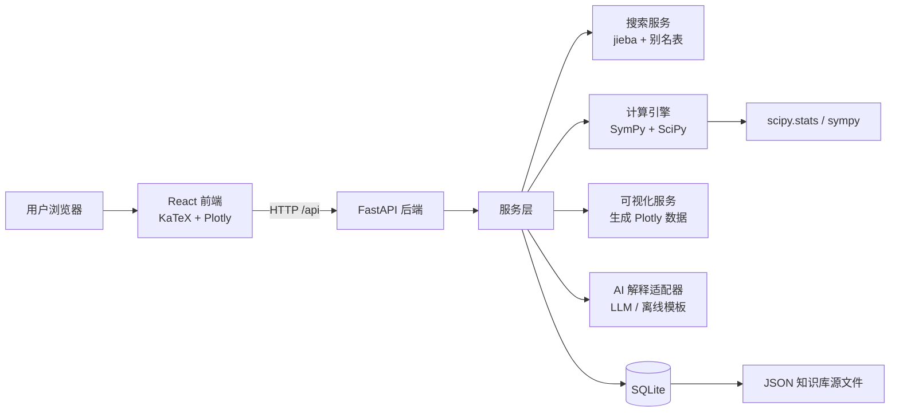
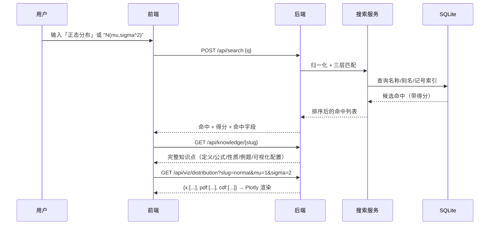
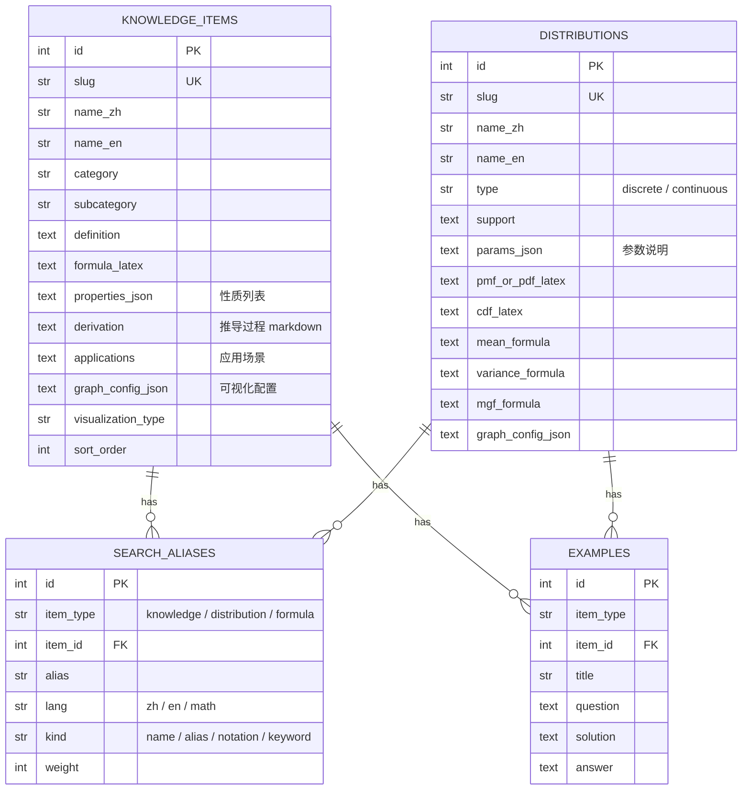
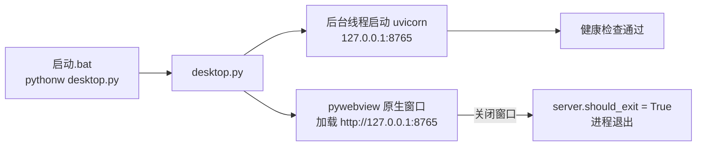

> **状态说明（2026-08-10）**：本文是 v1 阶段的架构设计记录，内容随迭代可能滞后。
> 当前系统状态、功能清单与验收结果见 **[项目报告.md](项目报告.md)**；API 契约见 **[api.md](api.md)**。
# 概率论与数理统计智能学习系统 — 总体架构设计（Phase 1）

> 版本：v0.1 · 状态：架构基线 · 作者：项目负责人
> 本文档是后续 7 个阶段的**设计契约**，阶段实现必须与本文保持一致；如有变更需回写本文。

---

## 1. 项目定位与目标

为大学《概率论与数理统计》学习者提供一个「查得到、看得懂、玩得转」的智能学习平台：

- **查得到**：输入中文名、英文名、数学记号（如 `P(A|B)`、`N(μ,σ²)`、`E(X)`）都能检索到正确知识点；
- **看得懂**：每个知识点按统一结构展示：定义 → LaTeX 公式 → 定理/性质 → 参数说明 → 推导 → 应用场景 → 经典例题；
- **玩得转**：分布图像可拖动参数实时变化；中心极限定理、贝叶斯公式用动画演示；
- **算得准**：内置数学计算引擎，输入 `P(X<1.96)` 返回 `0.975`，输入分布与样本可求 MLE、期望、方差。

---

## 2. 总体架构



**数据流（一次搜索 → 学习页）**：



---

## 3. 技术选型与理由

| 关注点 | 选型 | 理由 |
| --- | --- | --- |
| 前端框架 | React 18 + TypeScript + Vite | 组件化、类型安全、构建快 |
| 样式 | Tailwind CSS | 快速搭建教学界面，主题可定制 |
| 公式 | KaTeX（`katex` 包） | 比 MathJax 快，适合大量公式；SSR/CSR 均可 |
| 可视化 | Plotly.js + react-plotly.js | 开箱即用的交互缩放/滑块/动画，后端给数据前端渲染 |
| 后端 | Python FastAPI | 与 SymPy/SciPy 同生态，自动 OpenAPI 文档 |
| 数据库 | SQLite + SQLAlchemy 2.0 | 单机部署零配置；ORM 便于未来迁移 PostgreSQL |
| 符号计算 | SymPy | 求导/积分/化简/MLE 推导 |
| 数值计算 | SciPy + NumPy | 分布 CDF/分位数/随机抽样/拟合 |
| 中文搜索 | jieba 分词 + 自建别名表 | 轻量、离线、可控；未来可替换为 SQLite FTS5/MeiliSearch |

---

## 4. 目录结构（完整规划）

```
probstat-app/
├── docs/architecture.md          # 本文档
├── README.md
├── .gitignore
├── backend/
│   ├── requirements.txt
│   ├── .env.example
│   ├── app/
│   │   ├── main.py               # FastAPI 入口（CORS、lifespan、路由挂载）
│   │   ├── config.py             # 配置（环境变量优先）
│   │   ├── db.py                 # SQLAlchemy engine / Session（Phase 2）
│   │   ├── api/                  # 路由层：只做参数校验与转发
│   │   │   ├── router.py         # 路由聚合
│   │   │   ├── health.py         # ✅ Phase 1 已完成
│   │   │   ├── search.py         # ⏳ Phase 4
│   │   │   ├── knowledge.py      # ⏳ Phase 3/5
│   │   │   ├── distributions.py  # ⏳ Phase 6
│   │   │   ├── compute.py        # ⏳ Phase 5/6
│   │   │   ├── viz.py            # ⏳ Phase 6/7
│   │   │   └── ai.py             # ⏳ Phase 8
│   │   ├── services/             # 业务逻辑层
│   │   │   ├── search_service.py # ⏳ Phase 4
│   │   │   ├── knowledge_service.py  # ⏳ Phase 3
│   │   │   ├── compute_service.py    # ⏳ Phase 5（SymPy/SciPy 封装）
│   │   │   ├── viz_service.py        # ⏳ Phase 6（生成 Plotly 数据）
│   │   │   ├── expr_parser.py        # ⏳ Phase 5（受限表达式解析，不用 eval）
│   │   │   └── llm_service.py        # ⏳ Phase 8（适配器 + 离线模板）
│   │   ├── models/               # SQLAlchemy 模型（Phase 2）
│   │   ├── schemas/              # Pydantic 请求/响应模型
│   │   └── data/                 # JSON 知识库源文件（Phase 3）
│   ├── scripts/
│   │   ├── seed_db.py            # 建表 + 导入 JSON（Phase 2/3）
│   │   └── import_knowledge.py   # 知识库导入器
│   └── tests/                    # pytest（每个阶段配套测试）
│       ├── test_health.py        # ✅
│       ├── test_search.py        # ⏳ Phase 4
│       ├── test_compute.py       # ⏳ Phase 5
│       └── test_viz.py           # ⏳ Phase 6
└── frontend/
    ├── package.json / vite.config.ts / tsconfig.json
    ├── index.html
    └── src/
        ├── main.tsx / App.tsx / index.css
        ├── api/client.ts         # 类型化 API 客户端（按模块扩展）
        ├── components/           # Layout、SearchBar、Formula、PlotCard、Slider...
        ├── pages/                # Home、Knowledge、Distribution、Calculator、Theorems
        └── lib/                  # katex 封装、类型定义
```

**分层原则**：`api/`（路由）→ `services/`（逻辑）→ `models/`（数据）单向依赖；`schemas/` 是前后端共享契约。

---

## 5. 数据库设计草案（Phase 2 细化）

在用户给定 `Knowledge`、`Distribution` 两张表的基础上，**提出规范化改进**（详见 §9）：



**设计要点**：
- `slug` 作为 URL 与 API 的稳定标识（如 `normal-distribution`、`bayes-theorem`）；
- `name_zh` / `name_en` 分离，`aliases` 独立成表并带 `weight`，是搜索系统的核心；
- 文本类字段存 **Markdown + LaTeX 内联**（如 `定义：$X \sim N(\mu,\sigma^2)$`），前端统一用 KaTeX 渲染；
- JSON 知识库文件是**事实来源**，SQLite 是导入后的查询副本，支持未来扩展到 10000+ 知识点而不改动数据库结构。

---

## 6. API 设计（REST，前缀 `/api`）

| 方法 | 路径 | 说明 | 阶段 |
| --- | --- | --- | --- |
| GET | `/health` | 健康检查 | ✅ 1 |
| GET | `/health/meta` | 元信息/模块清单 | ✅ 1 |
| POST | `/search` | 智能搜索 `{q, limit}` → 排序命中 | ⏳ 4 |
| GET | `/knowledge/{slug}` | 知识点详情（含公式/例题/可视化配置） | ⏳ 3/5 |
| GET | `/knowledge?category=...` | 按分类浏览 | ⏳ 3 |
| GET | `/distributions` | 分布列表 | ⏳ 6 |
| GET | `/distributions/{slug}` | 分布详情（PDF/CDF/均值/方差） | ⏳ 6 |
| POST | `/compute/probability` | 解析 `P(X<1.96)` 等表达式 | ⏳ 5 |
| POST | `/compute/mle` | 给定分布+样本求 MLE | ⏳ 5 |
| GET | `/viz/distribution` | `?slug=normal&mu=&sigma=` → Plotly 数据 | ⏳ 6 |
| GET | `/viz/clt` | 中心极限定理模拟数据（n、样本数） | ⏳ 7 |
| POST | `/ai/explain` | 知识点讲解（LLM 或离线模板） | ⏳ 8 |

所有响应统一 JSON；错误使用 `{detail: string}`。

---

## 7. 搜索系统设计（Phase 4）

```mermaid
flowchart TD
    Q[用户输入] --> N[归一化<br/>去空白/全角转半角/小写]
    N --> L1[第一层：名称/别名精确匹配<br/>权重 100/90]
    N --> L2[第二层：记号匹配<br/>P(A|B) N(mu,sigma^2) 权重 85]
    N --> L3[第三层：jieba 分词 + 编辑距离/包含 权重 40-60]
    L1 & L2 & L3 --> R[合并去重取最高分]
    R --> S[按分数排序 + 命中字段说明]
    S --> O[返回给前端]
```

**中文搜索**：jieba 分词后对名称、别名、关键词做包含匹配；
**公式搜索**：输入做 Unicode 归一（`μ→mu`、`σ→sigma`、`²→^2`、全角括号→半角）后匹配 `notation` 别名（如 `normal`、`N(mu,sigma^2)`、`P(A|B)`）；
**打分**：精确名称 100 > 精确别名 90 > 记号 85 > 分词命中 60 > 编辑距离模糊 40。

---

## 8. 计算引擎与可视化设计

**计算引擎（Phase 5）**：
- 数值计算（SciPy）：分布 CDF/PDF/分位数、随机数抽样、统计检验；
- 符号计算（SymPy）：期望/方差积分、矩估计、MLE 推导（对给定分布求对数似然→求导→解方程）；
- **安全解析**：`P(X<1.96)` 这类表达式用**受限语法解析器**（正则 + AST 白名单）转换为 SciPy 调用，**绝不使用 `eval`**。

**可视化（Phase 6/7）**：
- 后端 `viz_service` 用 NumPy/SciPy 计算曲线数据（`{x, pdf, cdf, samples, histogram}`），前端 Plotly 渲染；
- 参数滑块（`μ`、`σ`、`n`、`p`、`df`…）变化时**只重新请求数据或前端重算**，保持流畅；
- 中心极限定理动画：后端一次性生成多组样本均值的直方图数据，前端用 Plotly 动画逐帧播放。

---

## 9. 对原始需求的设计改进（主动提出）

1. **表结构规范化**：原设计仅 `Knowledge`/`Distribution` 两表，字段冗长（properties/examples 为文本）。
   改进：拆出 `search_aliases`（搜索专用索引表）与 `examples` 表，正文长字段保留为结构化 JSON/Markdown。
2. **JSON 为事实来源 + SQLite 为查询副本**：支持 10000+ 知识点时只加 JSON 文件不改表结构，导入脚本幂等（upsert）。
3. **记号搜索**：原始需求只提关键词；我们额外建 `notation` 别名并做 Unicode 归一，支持 `N(μ,σ²)`、`P(A|B)` 直接命中。
4. **计算安全**：数学表达式不直接 eval，使用受限解析器；这是教学软件的安全底线。
5. **AI 解释做适配器**：默认离线模板引擎（基于结构化数据生成讲解，无需 API Key、可离线），可选接入 OpenAI 兼容接口，通过环境变量开关。
6. **前后端契约先行**：Pydantic schema 与 TypeScript 类型人工对齐（Phase 4 起可引入 openapi-typescript 自动生成）。
7. **可视化数据后置**：曲线数据由 Python 计算（保证数学正确），前端专注交互渲染，避免 JS 端重复实现分布公式。

---

## 10. 开发进度

8 个开发阶段（架构骨架 → 数据库 → 知识库 → 搜索 → 公式 → 可视化 → 动画 → AI）已全部完成，
验收结果与功能清单见 **[项目报告.md](项目报告.md)**。

## 11. 本地桌面运行模式（新增）

| 模式 | 用途 | 启动方式 |
| --- | --- | --- |
| 🖥️ 桌面模式（推荐） | 日常学习 | 双击「启动概率论与数理统计学习系统.bat」 |
| 🌐 开发模式 | 改代码/调试 | uvicorn + `npm run dev` |

**桌面模式原理**：



- 前端构建产物由后端 `main.py` 静态托管（`/assets` + SPA 回退），单端口部署；
- WebView2 缺失时自动回退浏览器；`desktop.log` 记录运行日志；
- 该模式对用户透明：安装一次依赖后，日常只需双击 .bat。

---


## 12. 运行方式

当前运行方式（桌面版 / exe / 开发模式）见 **[README.md](../README.md)**。
