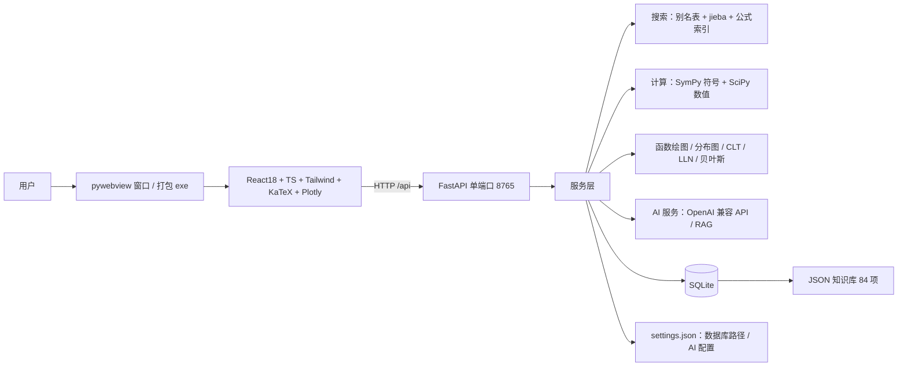

# 概率论与数理统计智能学习系统 —— 项目报告

> 版本：v3.1（2026-08-10）· 状态：✅ 已交付 · 根目录：`C:\Users\haiju\Desktop\学习\probstat-app`

## 1. 项目概述

面向大学《概率论与数理统计》学习者的**本地智能学习平台**：

- **公式即答案**：`P(X<1.96)→0.975`、分布/统计量计算、Wolfram 式符号计算（求导/积分/极限/解方程）；
- **交互式绘图**：函数实验室（多曲线、参数滑块+数值输入、x/y 视图滑块、切线/积分/导数/根）、11 种分布图、定理动画；
- **教学平台**：84 个知识点、中英/记号/公式智能搜索、KaTeX 公式渲染、AI 讲解与问答。

完全本地离线运行（React 构建产物由 FastAPI 单端口托管，pywebview 原生窗口），可打包为单个 exe；AI 功能可选接入 OpenAI 兼容大模型 API。

## 2. 功能清单

| 模块 | 能力 |
| --- | --- |
| 🔍 智能搜索 | 中文 / 英文 / 数学记号 / **公式**（`∫x²dx`、`sin(x)/x`、`P(X<1.96)`）多层打分 + jieba 分词 |
| 📚 知识库 | **84 个知识点**（8 大分类）/ 666 别名 / 115 例题，JSON 为事实来源、SQLite 查询副本 |
| 📐 公式系统 | 内容全部 LaTeX 存储，KaTeX 渲染（裸 LaTeX 自动包裹 + 容错，不报红） |
| 🧮 计算引擎 | 概率表达式、分布 pdf/cdf/分位数/均值/方差、MLE、**符号计算**（SymPy 受限解析器，无 eval） |
| 📈 分布可视化 | 11 种分布：参数滑块、PDF/PMF+CDF 双轴、概率阴影区 |
| 📐 函数实验室 | 多曲线、参数滑块+数值输入+重置、**x/y 视图滑块与预设**、切线/积分阴影/导数/根、缩放平移/悬停坐标/导出 |
| 🎬 定理动画 | **嵌入各知识点页**：中心极限定理、大数定律频率收敛、贝叶斯先验→似然→后验 |
| 🤖 AI 讲解/问答 | 设置页接入 OpenAI 兼容 API，讲解/问答走大模型；未配置/失败明确提示，**无离线回退** |
| ⚙️ 设置 | 数据库位置热切换、AI API 配置（Key/BaseURL/Model/连通性测试） |
| 🖥️ 桌面与导航 | pywebview 原生窗口、全局「← 返回」按钮、一键启动/安装脚本 |
| 📦 打包 | PyInstaller 单文件 exe（约 106 MB），双击即用，无需安装环境 |

## 3. 技术架构



数据流：JSON 知识库（事实来源）→ 启动/`seed_db.py --import` 幂等导入 SQLite → 搜索/计算/绘图/AI 读取 SQLite。

## 4. 知识库内容（84 项 / 666 别名 / 115 例题）

| 分类 | 数量 | 内容 |
| --- | --- | --- |
| 基础概率 | 7 | 样本空间、随机事件、概率公理、条件概率、独立性、全概率、贝叶斯 |
| 随机变量 | 14 | 随机变量、分布函数、PMF/PDF、期望、方差、协方差 + 联合/边缘/条件分布、独立性、函数分布、条件期望、相关系数、矩与矩母函数 |
| 离散分布 | 4 | 二项、泊松、几何、超几何 |
| 连续分布 | 7 | 正态、指数、均匀、Gamma、卡方、t、F |
| 数理统计 | 13 | 总体样本、统计量、矩估计、MLE、区间估计、假设检验、方差分析、回归 + 估计量评选、抽样分布、拟合优度、贝叶斯估计、顺序统计量 |
| 定理 | 4 | 大数定律、中心极限定理、切比雪夫不等式、泊松定理 |
| 基础数学 | 14 | 集合、函数与反函数、指数/对数、三角函数、三角恒等式、正割/余割/余切、反三角、数列、排列、组合、二项式定理、不等式、复数 |
| 高等数学 | 21 | 极限、无穷小、连续、导数、求导法则、中值定理、洛必达、泰勒、单调极值、不定积分、换元/分部、定积分、应用、反常积分、偏导数、二重积分、数项级数、幂级数、傅里叶级数、常微分方程 |

## 5. 核心功能

### 5.1 智能搜索
名称精确(100) > 别名(90) > 记号(85) > 分词覆盖(≤90) > **公式/正文匹配(55–70)** > 模糊(≤50)；归一化使 `N(μ,σ²)`≡`N(mu,sigma^2)`。实测 `正态分布`、`P(A|B)`、`E(X)`、`∫x^2 dx`、`sin(x)/x`、`P(X<1.96)` 均正确命中。

### 5.2 计算引擎（受限解析器，无 eval）
- 概率：`P(X<1.96)`、`P(X>a)`、`P(a<X<b)`、`~N(μ,σ²)` 后缀；
- 分布：pdf/cdf/分位数/均值/方差（SciPy）；MLE：正态/指数/泊松（SymPy 推导+数值）；
- 符号：`derivative(...)`、`integral(...)`、`limit(...)`、`solve(...)`、`sum(...)`，白名单函数+符号校验，结果 LaTeX+数值双显示。

### 5.3 可视化与动画
- 分布图（11 种）+ 概率阴影区 `P(a<X<b)`；
- 函数实验室：多曲线、参数滑块 + **数值输入** + 重置、**x/y 视图滑块**与预设、切线/积分阴影/导数/根标记、缩放平移/悬停坐标/导出；
- 定理动画**嵌入知识点页**：CLT、大数定律、贝叶斯（固定随机种子可复现）。

### 5.4 AI 功能（纯 API 模式）
- 问答助手（RAG 检索上下文）、知识点讲解、自动出题、相关推荐；
- 配置：设置页 `settings.json`（enabled/api_key/base_url/model），环境变量兜底；
- 未配置 → `not_configured` 明确提示；失败 → `error` 展示原因；**无离线回退**；
- 前端 Markdown：裸 LaTeX 自动包裹 + KaTeX 容错。

### 5.5 设置与桌面部署
- 数据库位置热切换（重建引擎+建表+导入）；AI API 配置 + 连通性测试；`settings.json` 已入 .gitignore 保护 Key；
- 桌面：`启动.bat` → desktop.py（uvicorn 内嵌 + pywebview），全局「← 返回」；
- 打包：PyInstaller onefile + windowed → `dist\概率统计学习系统.exe`（约 106 MB），资源打进 exe、数据库/设置/日志写在 exe 同目录。

## 6. 参考的开源项目

**概率统计方向**：Seeing Theory（贝叶斯三段可视化）、SOCR CLT Webapp（CLT 动画）、SymPy Gamma（答案卡片式结果）、statistics-101（概率阴影区）、distribution-explorer（分布目录）、Numbas（随机题库）、PhET（分层教学）。

**高数/基础数学方向**：OpenStax Calculus 与 awesome-math（章节骨架）、南瓜书 pumpkin-book（公式即条目/前置知识）、Mathigon（内容-渲染分离）、mathjs+Plotly（自研函数绘图，可商用授权）。

> 注：GeoGebra 交互范式（滑块/视图）作为设计参考，其源码为 EUPL/非商业授权，故采用自研等价实现。

## 7. 测试与验收

| 项目 | 结果 |
| --- | --- |
| 后端 pytest | **65 passed**（搜索/公式搜索/计算/符号/可视化/AI/设置/数据库/函数绘图） |
| 前端构建 | TypeScript strict + Vite 通过 |
| 全站巡检（Playwright） | 18 页 0 个 4xx/5xx |
| 桌面端 | `启动.bat` 窗口正常、知识库自动导入、健康检查 ok |
| 打包 exe | `dist\概率统计学习系统.exe`（约 106 MB），实测启动/搜索/计算/滑块/符号计算全部正常 |
| 真实 AI 实测 | 已配置 API 时问答/讲解返回 `mode=llm`（含公式渲染） |

## 8. 运行与使用

```powershell
# 日常使用
双击「启动.bat」（或直接运行 dist\概率统计学习系统.exe）

# 开发
cd backend && ..\.venv\Scripts\python.exe -m pytest -q
..\.venv\Scripts\python.exe scripts\seed_db.py --import
cd frontend && npm run build
```

导航：首页 / 搜索 / 分布探索 / 函数实验室 / 计算器 / AI 助手 / 设置（非首页有「← 返回」）。

## 9. 已知限制与后续规划

- 多元函数 3D 曲面、ODE 方向场暂未覆盖（Plotly 支持 3D，可扩展）；
- AI 输出偶发不规范 LaTeX：已做自动包裹+容错，可继续加针对性清洗；
- 知识点前置依赖（先修图/学习路径）未建模；
- 题库可扩展为 Numbas 式随机参数+自动判分；可做 onedir 版加快启动。

---

*配套文档：[api.md](api.md)（API 契约）、[architecture.md](architecture.md)（v1 架构设计记录）。*